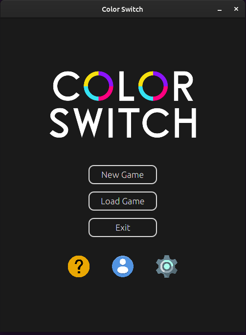
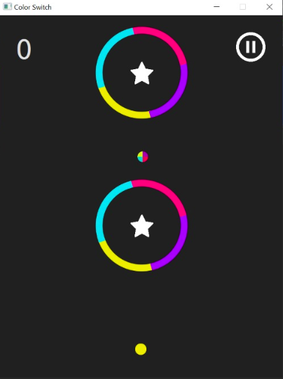
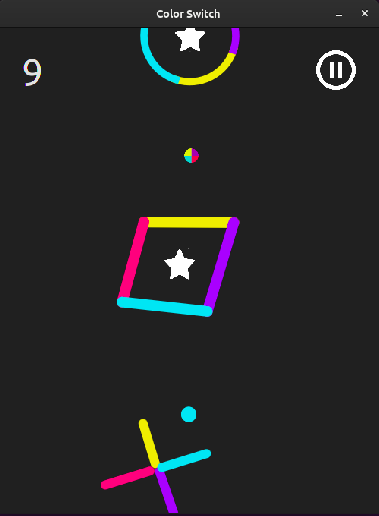
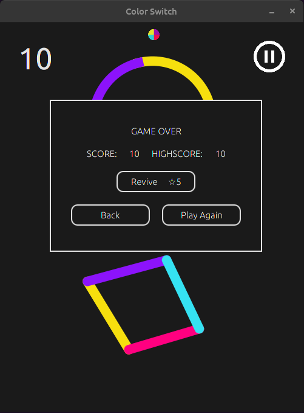
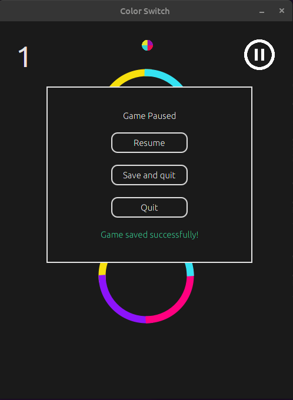
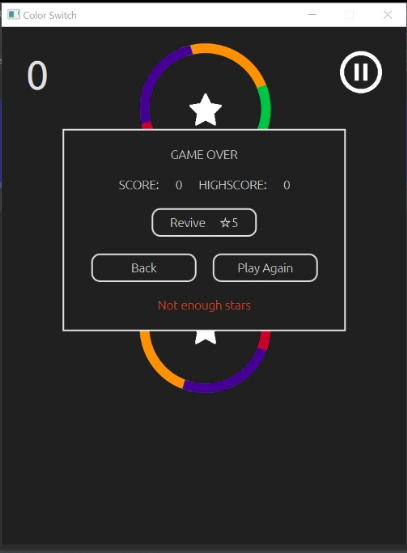
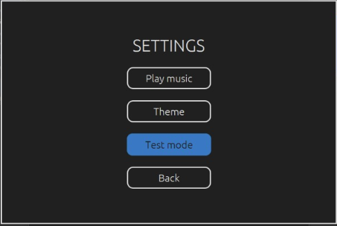
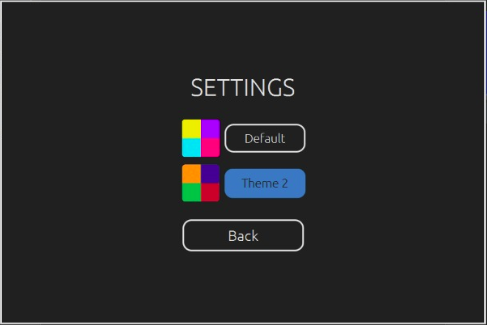
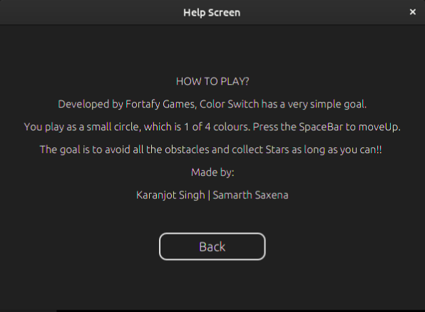
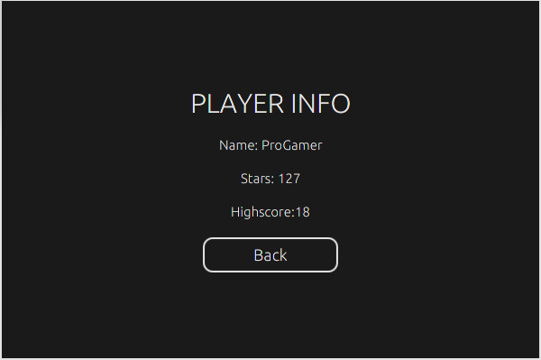

# ColorSwitch
JavaFx Implementation of popular game ColorSwitch developed by Fortafy Games https://colorswitch.co/

## About
Color Switch is an obstacle-based gaming app. The objective of the app is to play through levels of increasing difficulty, by tapping a small ball of a certain colour through shapes of a matching colour. The skills required to use the app include quick reflexes and and motor skills.

## Installation Guide

### Set up JDK
Java 13 is required to run this application.
<br />
To install Java 13 on Debian / Ubuntu:

```sudo apt install openjdk-15-jdk```

### Install openjfx
To install Java 13 on Debian / Ubuntu:
<br />
```sudo apt-get install openjfx```

### Run the game
```Run Main.java using an IDE```

## Screenshots
 
 
 
 
 
